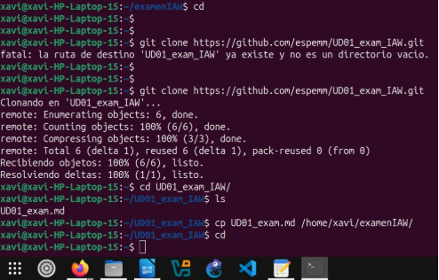

Creacio del repositori: Crear un repositori.

\- Per a crear un repositori, accedim al menu de github i seleccionem new. Afegim si volem un readme.md i el inicialitzem al nostre ordinador per a poder treballar.

v

Clonar repositori de espe 

Per a fer els nous canvis ens creem una rama nova anomenada examen

Crear mkdocs

Editem el .yaml amb la documentació que volem afegir:

Comprovem que podem accedir amb un mkdocs serve
